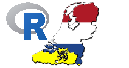

# Open Dutch Wordnet in R

Open Dutch WordNet is a Dutch lexical semantic database. The database provides cognitive synonyms and lexical entries for the Dutch language.



The  **wordnet.dutch** package provides the Open Dutch Wordnet database in R format and provides R functions to easily work with the dataset. 

This data is available in several objects:

- dutch_synset: Dutch synthetic sets
- ...


## Installation

To install the latest version from this repository

```
devtools::install_github("jwijffels/wordnet.dutch", build_vignettes = TRUE)
```

Have a look at the vignette
```
vignette("open-dutch-wordnet-introduction", package = "wordnet.dutch")
```

## Support in text mining

Need support in text mining. 
Contact BNOSAC: http://www.bnosac.be

